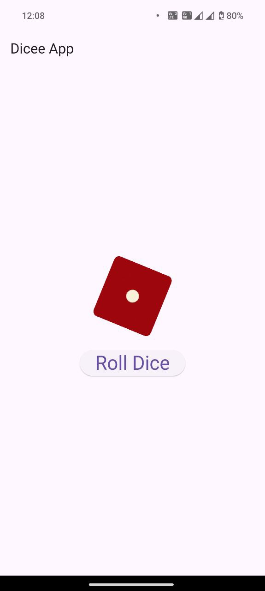

# Dicee App
This is my first Flutter application. It is a basic Dice Roll app. 

## Things I learned through this app
- [Stateful](https://api.flutter.dev/flutter/widgets/StatefulWidget-class.html) and [Stateless](https://api.flutter.dev/flutter/widgets/StatelessWidget-class.html) Widget
- [Material](https://api.flutter.dev/flutter/material/Material-class.html) Widget
- [Splash](https://pub.dev/packages/flutter_native_splash) Screen
- Scaffold Widget
- [How to set the app launcher icon](https://www.geeksforgeeks.org/flutter-changing-app-icon/)

### Screenshot
  
